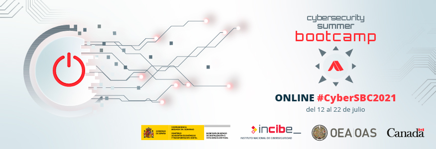

# INCIBE Cybersecurity Summer BootCamp 2021 :closed_lock_with_key:


## Detección de amenazas a escala utilizando [osquery](https://osquery.io) y [osctrl](https://osctrl.net)

Ponente | Temática
------------ | -------------
Javier Marcos de Prado | Digital Forensics and Incident Response (DFIR)
:link: | [https://www.incibe.es/summer-bootcamp/sbc2021/programa/TC6](https://www.incibe.es/summer-bootcamp/sbc2021/programa/TC6)

1. Introducción a la necesidad de desplegar infraestructura de detección, tanto en entornos corporativos como de producción.

2. Enumeración de los pasos necesarios para la automatización y despliegue de osquery como agente dentro de una red distribuida y escalable.

3. Muestra del servidor centralizado o TLS endpoint (osctrl), y la configuración y uso de sus diferentes componentes para una detección de amenazas y para la respuesta a incidentes y la gestión de flotas.

___

## :information_source: Preparación del taller

Todas las demostraciones y ejemplos del taller se realizarán en directo pero en el caso de querer seguir las mismas de un modo interactivo, se pueden seguir las indicaciones mediantes el uso de osquery (cliente) y osctrl (servidor).

### :boom: Instalación de [osquery](https://osquery.io)

Se recomienda la descarga e instalación de osquery, version `4.9.0`, siendo ésta la última versión disponible en el momento de escribir esta guía. Para su instalación, se puede [descargar](https://osquery.io/downloads/official/4.9.0) para múltiples plataformas.

También es posible la instalación a través de gestores de paquetes en macOS, Windows y diferentes versiones de Linux (RPM y DEB):

:white_small_square: **macOS usando [brew](https://brew.sh/)**
```shell
brew install --cask osquery
```

:white_small_square: **Windows usando [chocolatey](https://chocolatey.org/)**
```shell
choco install osquery
```

:white_small_square: **Debian Linux (DEB)**
```shell
export OSQUERY_KEY=1484120AC4E9F8A1A577AEEE97A80C63C9D8B80B
sudo apt-key adv --keyserver hkp://keyserver.ubuntu.com:80 --recv-keys $OSQUERY_KEY
sudo add-apt-repository 'deb [arch=amd64] https://pkg.osquery.io/deb deb main'
sudo apt-get update
sudo apt-get install osquery
```

:white_small_square: **RPM Linux**
```shell
curl -L https://pkg.osquery.io/rpm/GPG | sudo tee /etc/pki/rpm-gpg/RPM-GPG-KEY-osquery
sudo yum-config-manager --add-repo https://pkg.osquery.io/rpm/osquery-s3-rpm.repo
sudo yum-config-manager --enable osquery-s3-rpm-repo
sudo yum install osquery
```

### :boom: Despliegue de [osctrl](https://osctrl.net)

La instalación de `osctrl` en un entorno de desarrollo puede realizarse de varias formas. El resultado será una instancia 100% funcional con la que seguir las indicaciones y ejemplos del taller.

El primer paso es descarga o clonado del repositorio [https://github.com/jmpsec/osctrl](https://github.com/jmpsec/osctrl):

```shell
git clone https://github.com/jmpsec/osctrl
```

:white_small_square: **Despliegue con [Docker](https://www.docker.com/)**

Para desplegar `osctrl` usando Docker la mejor opción es la utilidad `dockerize.sh` ya que realiza algunas tareas de configuración previas al lanzamiento de `osctrl`. También se puede utilizar el [Makefile](https://github.com/jmpsec/osctrl/blob/master/Makefile) y el comando `make docker_all` para simplificar las cosas, o directamente `dockerize.sh`:

```shell
./deploy/docker/dockerize.sh -u -b -f
```

El comando se encargará del build (`-b`) y ejecución (`-u`), con creación de nuevos certificados y configuración (`-f`).

Para más informacion sobre `dockerize.sh` se puede utilizar `-h` para una ayuda detallada.

:white_small_square: **Despliegue con [Vagrant](https://www.vagrantup.com/)**

:white_small_square: **Despliegue standalone en Ubuntu**

### :bulb: Ejemplos

## :pray: ¡Muchas gracias y que disfrutéis del taller! :raised_hands:
